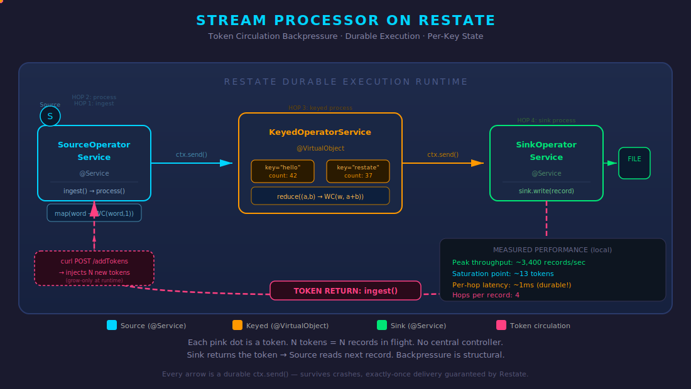

# Stream Processor on Restate

A Flink-like stream processing library built on [Restate](https://restate.dev) — demonstrating how Restate's durable execution, Virtual Objects, and state management can back familiar stream processing abstractions.

Every operator invocation is a durable Restate call. Every piece of state is managed by Restate. The pipeline survives crashes with exactly-once guarantees — no external coordination, no checkpointing, no Zookeeper.

## Architecture

<p align="center">
  
</p>

The user builds a pipeline via a fluent API:

```java
env.addSource(new RandomWordSource())
    .map(word -> new WordCount(word, 1))
    .keyBy(WordCount::word)
    .reduce((a, b) -> new WordCount(a.word(), a.count() + b.count()))
    .addSink(new FileSink<>("/tmp/wordcount-output.txt"));

env.execute("ContinuousWordCount");
```

This compiles into three Restate service stages:

| Stage | Restate Type | Role |
|-------|-------------|------|
| **SourceOperatorService** | `@Service` | Reads from source, applies stateless operators (map/filter/flatMap), routes by key |
| **KeyedOperatorService** | `@VirtualObject` | Per-key stateful processing (reduce, ProcessFunction). Each key is a separate Virtual Object with isolated state |
| **SinkOperatorService** | `@Service` | Writes results to the configured sink |

Records flow between stages via `ctx.send()` — durable one-way calls that survive crashes and guarantee exactly-once delivery.

## Token Circulation Backpressure

For unbounded (continuous) sources, backpressure is structural:

1. At startup, inject **N tokens** via `addTokens(N)`. Each token is an `ingest()` invocation.
2. Each `ingest()` reads **one record** from the source and sends it through the pipeline.
3. When the **sink finishes writing**, it calls `ingest()` again — returning the token.
4. Exactly **N records are in flight** at any time. No central controller, no shared state.
5. `addTokens()` injects more tokens at runtime (grow-only) to increase throughput.

### Measured Performance (local, single-node)

| Metric | Value |
|--------|-------|
| Peak throughput | ~3,400 records/sec |
| Saturation point | ~13 tokens |
| Per-hop latency | ~1ms (durable!) |
| Hops per record | 4 |

Throughput scales linearly with tokens up to saturation:

```
Tokens | Lines/sec
-------|----------
     1 |    673
     2 |  1,173
     3 |  1,535
     5 |  2,182
    10 |  3,246
    13 |  3,491  ← saturation
    20 |  3,232
```

## Getting Started

### Prerequisites

- Java 21+
- [Restate Server](https://restate.dev/get-restate/) (or `brew install restatedev/tap/restate-server`)
- [Restate CLI](https://docs.restate.dev/develop/local_dev/) (or `brew install restatedev/tap/restate`)

### Run the Continuous Word Count

```bash
# Terminal 1: Start Restate
restate-server

# Terminal 2: Start the stream processor
./gradlew :stream-processor-example:runContinuous

# Terminal 3: Register and start
restate deployments register http://localhost:9080 --yes
curl -X POST http://localhost:8080/SourceOperatorService/addTokens \
  -H 'content-type: application/json' -d '10'

# Terminal 4: Watch the output
tail -f /tmp/wordcount-output.txt
```

To increase throughput at runtime:

```bash
curl -X POST http://localhost:8080/SourceOperatorService/addTokens \
  -H 'content-type: application/json' -d '100'
```

### Run the Bounded Word Count

```bash
./gradlew :stream-processor-example:run
restate deployments register http://localhost:9080 --yes
curl -X POST http://localhost:8080/SourceOperatorService/ingest
```

## Key Mapping: Flink → Restate

| Flink Concept | Restate Equivalent |
|--------------|-------------------|
| `keyBy()` | Virtual Object key partitioning |
| Keyed state (`ValueState`, `ReducingState`) | `StateKey` / `ctx.get()` / `ctx.set()` |
| Exactly-once per-key processing | Virtual Object exclusive handler semantics |
| Durable operator execution | Restate journal replay |
| Checkpointing | Not needed — every call is already durable |

## Project Structure

```
stream-processor-core/       # The library
  api/                       # User-facing: DataStream, KeyedStream, StreamExecutionEnvironment
  api/functions/             # MapFunction, FilterFunction, ReduceFunction, ProcessFunction, etc.
  api/source/                # Source interface, InMemorySource, RandomWordSource
  api/sink/                  # Sink interface, ConsoleSink, FileSink
  internal/                  # Pipeline compilation and Restate service implementations

stream-processor-example/    # Demo applications
  WordCountExample           # Bounded: processes a fixed collection
  ContinuousWordCountExample # Unbounded: continuous random words with backpressure
```
